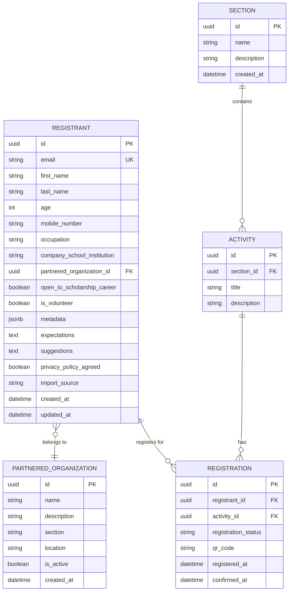

# Entity Relationship Diagram

## Arduino Day Philippines Registration System

This document presents the Entity Relationship Diagram for the Arduino Day Philippines Registration System.

---

## ERD Diagram



---

## Entity Descriptions

### REGISTRANT

The main entity representing individuals who register for Arduino Day Philippines activities.

| Attribute                  | Type         | Description                                                                                                         |
| -------------------------- | ------------ | ------------------------------------------------------------------------------------------------------------------- |
| id                         | UUID         | Primary key, unique identifier                                                                                      |
| email                      | VARCHAR(255) | Unique email address for identification                                                                             |
| first_name                 | VARCHAR(100) | Registrant's first name                                                                                             |
| last_name                  | VARCHAR(100) | Registrant's last name                                                                                              |
| age                        | INT          | Registrant's age                                                                                                    |
| mobile_number              | VARCHAR(20)  | Contact phone number                                                                                                |
| occupation                 | VARCHAR(100) | Current occupation/profession                                                                                       |
| company_school_institution | VARCHAR(255) | Affiliated organization                                                                                             |
| partnered_organization_id  | UUID         | Foreign key to PARTNERED_ORGANIZATION (nullable - only for members of partnered organizations)                      |
| open_to_scholarship_career | BOOLEAN      | Interest in scholarship/career opportunities                                                                        |
| is_volunteer               | BOOLEAN      | Indicates if registrant is a volunteer/helper for the event                                                         |
| metadata                   | JSONB        | Flexible JSON field for storing additional information (e.g., volunteer role, assigned tasks, special requirements) |
| expectations               | TEXT         | Expectations for the event                                                                                          |
| suggestions                | TEXT         | Suggestions for improving the event                                                                                 |
| privacy_policy_agreed      | BOOLEAN      | Privacy policy consent                                                                                              |
| import_source              | ENUM         | Source of registration: 'web', 'google_sheets', 'excel'                                                             |
| created_at                 | DATETIME     | Record creation timestamp                                                                                           |
| updated_at                 | DATETIME     | Last update timestamp                                                                                               |

### SECTION

Represents different sections or tracks within Arduino Day Philippines.

| Attribute   | Type         | Description                                              |
| ----------- | ------------ | -------------------------------------------------------- |
| id          | UUID         | Primary key, unique identifier                           |
| name        | VARCHAR(255) | Section name (e.g., "Workshops", "Talks", "Exhibitions") |
| description | TEXT         | Section description                                      |
| created_at  | DATETIME     | Record creation timestamp                                |

### ACTIVITY

Represents specific activities within sections of Arduino Day Philippines.

| Attribute   | Type         | Description                    |
| ----------- | ------------ | ------------------------------ |
| id          | UUID         | Primary key, unique identifier |
| section_id  | UUID         | Foreign key to SECTION         |
| title       | VARCHAR(255) | Activity title                 |
| description | TEXT         | Activity description           |

### REGISTRATION

Junction table linking registrants to activities they've registered for.

| Attribute           | Type         | Description                                 |
| ------------------- | ------------ | ------------------------------------------- |
| id                  | UUID         | Primary key, unique identifier              |
| registrant_id       | UUID         | Foreign key to REGISTRANT                   |
| activity_id         | UUID         | Foreign key to ACTIVITY                     |
| registration_status | ENUM         | Status: 'pending', 'confirmed', 'cancelled' |
| qr_code             | VARCHAR(255) | Unique QR code for activity check-in        |
| registered_at       | DATETIME     | Registration timestamp                      |
| confirmed_at        | DATETIME     | Confirmation timestamp                      |

### PARTNERED_ORGANIZATION

Organizations partnered with Arduino Day Philippines. Each organization has a specific section and location. **Note**: Membership in a partnered organization is optional for registrants. Not all registrants need to be affiliated with a partnered organization.

| Attribute   | Type         | Description                            |
| ----------- | ------------ | -------------------------------------- |
| id          | UUID         | Primary key, unique identifier         |
| name        | VARCHAR(255) | Organization name                      |
| description | TEXT         | Organization description               |
| section     | VARCHAR(100) | Section/department of the organization |
| location    | VARCHAR(255) | Physical location of the organization  |
| is_active   | BOOLEAN      | Active partnership status              |
| created_at  | DATETIME     | Record creation timestamp              |

---

## Relationships Summary

| Relationship                        | Type                   | Description                                                                                                               |
| ----------------------------------- | ---------------------- | ------------------------------------------------------------------------------------------------------------------------- |
| REGISTRANT → REGISTRATION           | One-to-Many            | A registrant can register for multiple activities                                                                         |
| ACTIVITY → REGISTRATION             | One-to-Many            | An activity can have multiple registrations                                                                               |
| SECTION → ACTIVITY                  | One-to-Many            | A section can contain multiple activities                                                                                 |
| REGISTRANT → PARTNERED_ORGANIZATION | Many-to-One (Optional) | A registrant can optionally belong to one partnered organization. Not all registrants are part of partnered organizations |

---

## Registration Flow

### Web Registration Flow

1. **Initial Entry**: User enters email and agrees to privacy policy
2. **Registration Form**: User fills out complete registration details including:
   - Personal information (name, age, mobile, occupation, company/school)
   - Optional partnered organization selection (registrants can skip this if not affiliated)
   - Scholarship/career opportunity interest
   - Expectations and suggestions for the event
3. **Activity Selection**: User selects activities to register for
4. **Processing**: Registration is created with 'pending' status and `import_source` set to 'web'
5. **Confirmation**: QR code is generated upon confirmation
6. **Registration Finder**: Users can retrieve their QR code using email, last name, and age

### Bulk Import Flow (Google Sheets/Excel) - OPTIONAL

**Purpose**: The bulk import feature is specifically designed for pre-registering:

- Members of partnered organizations
- Volunteers and event helpers
- Other pre-approved participants (speakers, organizers, sponsors, etc.)

**Note**: Regular attendees should use the web registration form. Bulk import is not intended for general public registration.

1. **Data Preparation**: Admin prepares spreadsheet with the following columns:

   **Required Columns:**
   - Email (unique identifier)
   - First Name
   - Last Name
   - Age
   - Mobile Number
   - Occupation
   - Company/School/Institution
   - Is Volunteer (Yes/No) - Indicates if registrant is helping with the event
   - Open to Scholarship/Career (Yes/No)

   **Optional Columns:**
   - Partnered Organization - Name of the partnered organization (must match database)
   - Volunteer Role - If volunteer, specify role (e.g., "Registration Desk", "Technical Support")
   - Assigned Tasks - Specific tasks or responsibilities
   - Special Requirements - Any special accommodations needed
   - Expectations
   - Suggestions
   - Activities - Comma-separated list of activity IDs or titles to pre-register

2. **Data Validation**: System validates the spreadsheet data:
   - Check for duplicate emails (across all registration sources)
   - Validate required fields are populated
   - Verify partnered organization exists in database (if provided)
   - Validate activity IDs/titles (if provided)
   - Check data format consistency
   - Ensure at least one of: partnered organization OR is_volunteer is true

3. **Bulk Import Processing**:
   - Create REGISTRANT records with `import_source` set to 'google_sheets' or 'excel'
   - Set `is_volunteer` flag based on spreadsheet data
   - Store additional information in `metadata` JSON field:
     - Volunteer role (if applicable)
     - Assigned tasks (if applicable)
     - Special requirements (if applicable)
     - Any other custom fields from spreadsheet
   - `privacy_policy_agreed` automatically set to `true` (pre-agreed before import)
   - Link to PARTNERED_ORGANIZATION if specified (field remains NULL if not provided)
   - Create REGISTRATION records for each activity (if specified)
   - Set `registration_status` to 'pending'

4. **QR Code Generation**: Generate unique QR codes for each imported registrant

5. **Email Notification**: Send confirmation emails to all imported registrants with:
   - Welcome message (customized for volunteers vs partnered org members)
   - QR code for event check-in
   - List of registered activities (if any)
   - Volunteer role and responsibilities (if applicable)
   - Registration finder instructions

6. **Import Report**: Generate report showing:
   - Total records processed
   - Successfully imported records (broken down by volunteers vs partnered org members)
   - Failed records with error details
   - Duplicate records (if any)
   - Records missing required criteria (neither volunteer nor partnered org member)

### Metadata Field Usage Examples

```json
// Example 1: Volunteer with assigned role
{
  "volunteer_role": "Registration Desk",
  "assigned_tasks": ["Check-in participants", "Distribute badges"],
  "shift_time": "9:00 AM - 12:00 PM",
  "tshirt_size": "L"
}

// Example 2: Partnered organization member
{
  "member_since": "2024-06-15",
  "member_id": "ORG-12345",
  "special_requirements": "Wheelchair accessible seating"
}

// Example 3: Speaker
{
  "role": "Speaker",
  "talk_title": "Introduction to Arduino IoT",
  "time_slot": "2:00 PM - 3:00 PM",
  "needs_projector": true
}
```

### Import Data Integrity

- Bulk import is restricted to partnered organization members and volunteers only
- All imported registrants have `import_source` field populated for audit trail
- `is_volunteer` flag clearly identifies event helpers
- `metadata` field provides flexibility for storing role-specific information
- Imported data goes through same validation as web registrations
- System prevents duplicate email addresses across all import sources
- Failed imports are logged with detailed error messages
- Partial imports are supported (successful records are saved, failed records are reported)
- Regular attendees must use the web registration form for proper data collection and consent

---

_Document generated for Arduino Day Philippines 2026_
_Last updated: January 2026_
